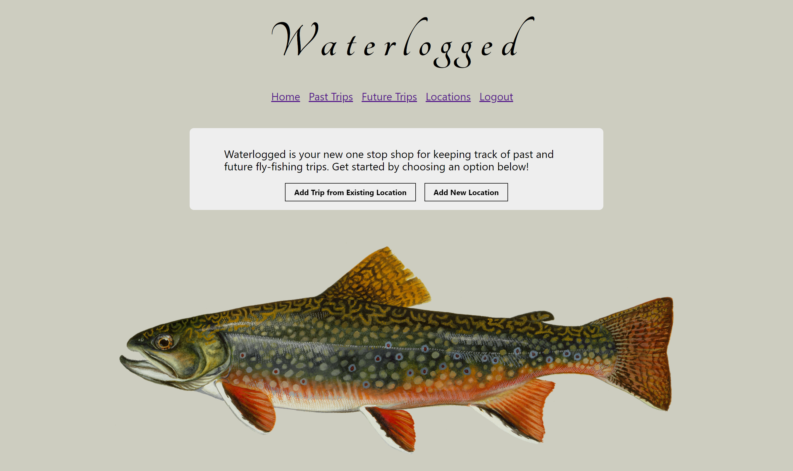

# Waterlogged

As an avid fly fisherman I set out to create an application to make the lives of fly anglers easier. Waterlogged is a web application that allows users to log details of past fly fishing trips and plan future fly fishing trips. Users can log details such as name of the body of water, date, season, gear used, and how the water was accessed. Users can also upload pictures of their trips. 

This application was built over a two week sprint for my front-end capstone project at Nashville Software School. Technologies used include React.js,  JSON Server for persistent data storage, and Tachyons for styling. 

To use this application, please follow these steps:

Clone this repository 
Navigate to the application directory 
Run npm start in the terminal 
Navigate to the api directory 
Run json-server in port 5002: json-server -p 5002 -w waterlogged.json 

This project was bootstrapped with [Create React App](https://github.com/facebook/create-react-app).
